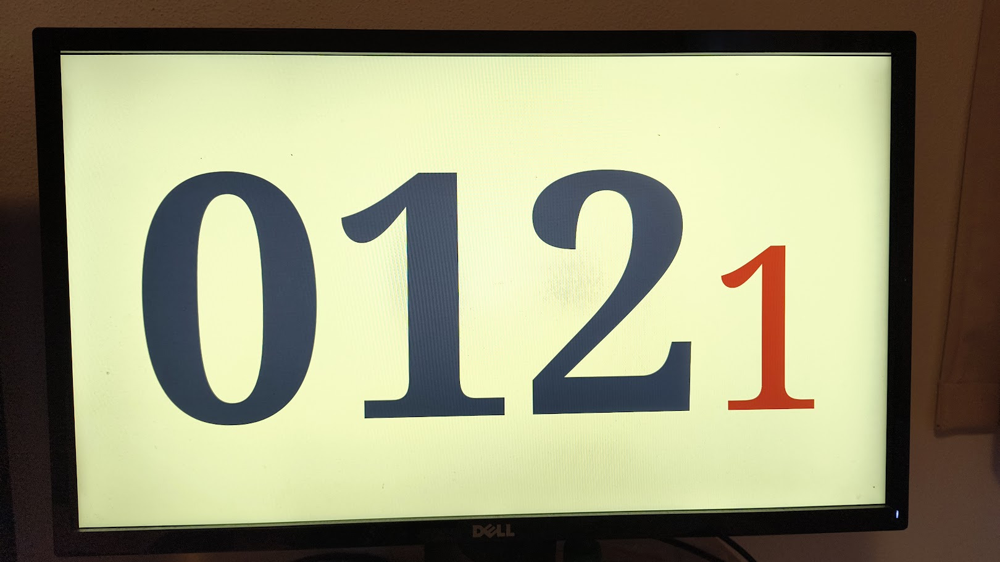
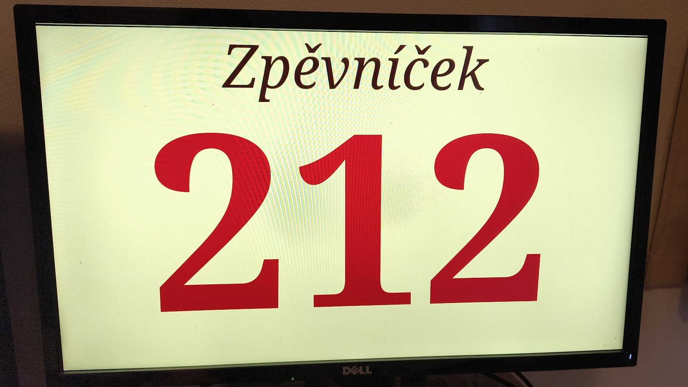

# Kostelní čísla
Ukazatel čísla písně například do kostelů. Umožńuje zobrazit číslo písně (3 číslice z Kancionálu) a volitelně číslo sloky i název zpěvníku. Čísla je možné ovládat přes libovolný chytrý telefon (tablet) - WiFi rozhraní, přes USB klávesnici (i bezdrátovou numerickou).

Hlavní výhodou těchto čísel je cena (kompletní náklady mohou být do 4000 Kč), jednoduchost nastavování, rozšířitelnost a mimo jiné i estetika. Čísla umožňují totiž nastavit barvy podle interiéru kostela a použité písmo se hodí k rázu kostelů.

Pokud se tímto kódem inspirujete, prosím kontaktujte autory pro uvedení referencí. Pokud systém rozšíříte o nějakou zajímavou funkčnost, rádi vaši úpravu zahrneme do hlavní větve. Produkt je šířen pod licencí [GPL](LICENSE) - projekty založené na našem projektu by měli mít stejnou licenci.

Systém nyní umožňuje zadat i žalm (antifonu). V databázi jsou přednahrané všechny Olejníkovy antifony, je možné však zadat a uložit libovolný další text. Při zadání speciálího kódu (999) se přepne na "Zpěvníček" na dětské mše. Vše je samozřejmě konfigurovatelné, u ordinárií se např. zobrazí název, je možné zavést další zpěvníky (např. Hosana atd). Stačí změna pár řádků kódu.






## Struktura souborů
 - [software](software) - složka s programem
   - [main.py](software/main.py) - hlavní modul
   - [display.py](software/display.py) - zobrazování, logika slok atd.
   - [web.py](software/web.py) - webový server
   - [files](software/files) - statická data webového serveru; musí být explicitně vyjmenovaná ve [web.py](software/web.py)
   - [fonts](software/fonts) 
   
   
## Použité zařízení
Pro fungování těchto čísel potřebujete
 - rozumně velký monitor :computer:
    - nesmí to být TN technologie (špatné pozorovací úhly)
    - doporučuji s tenkým rámečkem, loga je možné přelepit lepící páskou
    - s podporou VESA držáku (kromě designových dneska většina)
 - RaspberryPi 
    - nejlépe s integrovanou WiFi
    - my zvolili Raspberry Pi Zero W 2
    - k tomu nutný samozřejmě zdroj, SD karta (celkem cca 600 Kč). SD kartu doporučuji kvalitnější (např pro kamery), min 8 GB.
 - VESA držák na zeď (podle stavebních dispozic kostela nebo i stojánek monitoru, pokud je umístěno na kazatelně)
 - ovládací zařízení - stačí tablet, je možné vytvořit vlastní zařízení s klávesnicí pro varhaníka
 - WiFi router (obyčejný, není potřeba, aby pak byl připojen k internetu), cca 400 Kč.
 - elektrická přípojka :electric_plug:

## Instalace Raspberry
Malý počítač je založený na systému Linux, proto je vhodné, aby zařízení nastavoval někdo, kdo se v Linuxu orientuje. Stačí jít přes návody na internetu

### Prvotní spuštění
Na Raspberry zařízení je vhodné dát nějakou distribuci s baličkovacím systeém, my zvolili *Raspbian Lite*. Čísla nevyužívají X-Window system, takže vše je v příkazové řádce. Pokud použijete Raspberry Pi Manager (oficiální nástroj), tak většinu nastavení (např wifi) můžete udělat před vytvořením obrazu

### Nastavení systému
Raspbian obsahuje nástroj `sudo raspi-config`, který umožňuje nastavit celou řadu důležitých parametrů

  - nastavit heslo
  - povolit SSH server
  - rozložení klávesnice
  - připojit dočasně k internetu přes WiFi
  - nastavit rozlišení obrazovky

Dále je potřeba do systému doinstalovat tyto nástroje (pygame je hlavní knihovna pro zobrazování, poslední dva nástroje jsou pro vytvoření WiFi hot-spotu a mc je určeno pro jednodušší správu):

```sh
    sudo apt-get install python3-pygame python3-tornado mc vim git libegl-dev
```

### Nahrání aplikace
Přes `git` stáhneme nejnovější verzi aplikace. Pro odzkoušení stačí spustit

```sh
git checkout https://github.com/mrazekv/church-numbers.git
cd church-numbers/software
cp zalm_cache.default.json zalm_cache.json # aktivace olejníkových žalmů

python3 main.py
# zadat tři nenulová čísla (viz poznámka na konci odstavce)
```

Program ukončíme stiskem klávesy ESC. V souboru [main.py](software/main.py) můžeme zakomentovat např. UART modul, pokud jej nechceme využivat. Nastavení všech barevných konstant naleznete v souboru [display.py](software/display.py), stejně tak můžete doplnit nějakou logiku pro zobrazení názvů zpěvníků atd. Program je psaný v jazyce **Python**, který by měl být jednoduše čitelný. Pozor jen na případnou záměnu mezer za tabulátory, to by mohlo potom program poškodit.

Pro nastavení startu programu při bootování systému vložte do souboru

```sh  
sudo nano /etc/rc.local
sudo chmod 0755 /etc/.rc.local
```

před příkaz `exit 0` následující kód
     
```sh
#!/bin/sh -e
plymouth --quit
cd /home/pi/church-numbers/software; python3 main.py 2>&1 >/dev/null
exit(0)
```

Po restartu můžete zkusit, že aplikace naběhne, stiskem klávesy ESC se dostanete vždy do konzole. V normální provozu však aplikace bude běžet pořád.

**Pozor** čísla jsou po startu vyplé, pro zapnutí stačí na numerické klávesnici odeslat nějaké nenulové trojčíslí. Pro vypnutí stačí odeslat kód *000*. Ve vypnutém stavu by odběr měl být minimální (monitoru i rPi). Samozřejmě už můžeme využít wifi

Nyní by mělo být možné se k WiFi připojit a na adrese http://192.168.XX.XX:8080  uvidíme klávesnici (je třeba změnit adresu podle konfigurace wifi).


### Nastavení splash-screen
Aby při spouštění systému neběžel text po obrazovce (jen na chvíli se objeví logo maliny, kterému se nevyhneme), je potřeba aktivovat balík *plymouth-screen*, který je sice nainstalován, ale potřebuje doladit. 


```bash

sudo apt-get install plymouth plymouth-themes pix-plym-splash

# aktivování obrazovky v menu Boot / splash screen
sudo raspi-config

# výpis použitelných témat
sudo plymouth-set-default-theme -l
# jedno jsme zvolili a nastavili
sudo plymouth-set-default-theme -R spinner
sudo reboot # zkusíme, jestli to funguje
```

### Vypínání displeje
Aby nám fungovalo vypínání displeje po neaktivitě (20 minut po vyplém 000 a 1.5 hodiny po trvale vyplém), je nutné na nejnovějším rasberry se přepnout na starý driver 
https://github.com/raspberrypi/firmware/issues/1224#issuecomment-1470791044. 

```sh
sudo nano /boot/firmware/config.txt
# Change dtoverlay=vc4-kms-v3d to dtoverlay=vc4-fkms-v3d
sudo reboot
```


Pak by měly fungovat příkazy
```sh
vcgencmd display_power 0 # vypnutí
vcgencmd display_power 1 # zapnutí
```

Další varianty, které mi ale nefungovaly:
```sh
kmsblank -c 0 # nefunguje při zaplém pygame modulu

sudo apt install cec-utils
echo 'standby 0' | cec-client -s -d 1    # turns OFF
echo 'on 0' | cec-client -s -d 1         # turns ON
```


### Fungování nad portem 80
Výhoda tohoto řešení je pak kompatibilita s HTTP/1.1 protokolem
```sh 
sudo apt install nginx
```

Do nginx konfigurace přidat
```conf
    ...
    location / {
        proxy_pass http://127.0.0.1:8080/;
        proxy_http_version 1.0;
        # First attempt to serve request as file, then
        # as directory, then fall back to displaying a 404.
        #try_files $uri $uri/ =404;
    }
    ....
```


## Podružný systém
Systém umožňuje, aby v jedné síti byly dvě zařízení - jedno hlavní a druhé podružné - další displej do jiné části kostela.

Pro tvorbu podružného systému použijte návod výše, spouštějte však `python3 slave.py`. Předtím je však nutné, aby všechna zařízení měla napevno nastavené IP adresy (např v routeru, aby se neměnili). V master zařízení v _display.py_ do paretru uri přidáte adresy všech SLAVE zařízení: `["http://IP_SLAVE_1:8000/set_status", "http://IP_SLAVE_2:8000/set_status", ...]`. Hlavní zařízení využívá port 8080, podružné 8000.


## Zastaralé návody
V samostatném souboru [WIFI.md](WIFI.md) je návod, jak vytvořit WiFi hotspot přímo na raspberry. Už není využíváno.