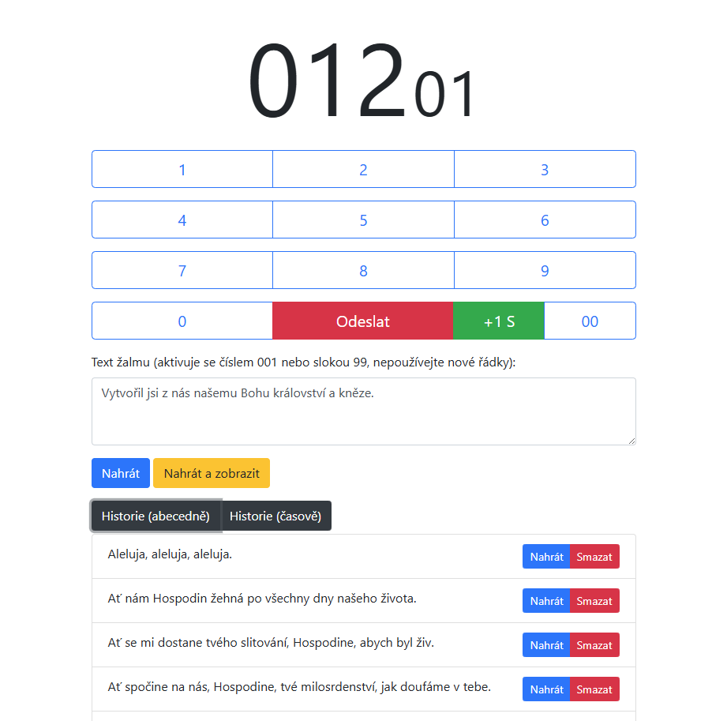

Kostelní čísla
=========================
Ukazatel čísla písně například do kostelů. Umožńuje zobrazit číslo písně (3 číslice z Kancionálu) a volitelně číslo sloky i název zpěvníku. Čísla je možné ovládat přes libovolný chytrý telefon (tablet) - WiFi rozhraní, přes USB klávesnici (i bezdrátovou numerickou) a nebo přes vlastní radiový přenos realizovaný nějakým modulem a převodníkem implementovaným např. přes Arduino.

Hlavní výhodou těchto čísel je cena (kompletní náklady mohou být do 4000 Kč), jednoduchost nastavování, rozšířitelnost a mimo jiné i estetika. Čísla umožňují totiž nastavit barvy podle interiéru kostela a použité písmo se hodí k rázu kostelů.

Pokud se tímto kódem inspirujete, prosím kontaktujte autory pro uvedení referencí. Pokud systém rozšíříte o nějakou zajímavou funkčnost, rádi vaši úpravu zahrneme do hlavní větve. Produkt je šířen pod licencí [GPL](LICENSE) - projekty založené na našem projektu by měli mít stejnou licenci.


Struktura souborů
============================
 - [software](software) - složka s programem
   - [main.py](software/main.py) - hlavní modul
   - [display.py](software/display.py) - zobrazování, logika slok atd.
   - [web.py](software/web.py) - webový server
   - [files](software/files) - statická data webového serveru; musí být explicitně vyjmenovaná ve [web.py](software/web.py)
   - [fonts](software/fonts) - použité písmo

Použité zařízení
==============================
Pro fungování těchto čísel potřebujete
 - rozumně velký monitor :computer:
    - nesmí to být TN technologie (špatné pozorovací úhly)
    - doporučuji s tenkým rámečkem, loga je možné přelepit lepící páskou
    - s podporou VESA držáku (kromě designových dneska většina)
 - RaspberryPi 
    - nejlépe s integrovanou WiFi
    - my zvolili Raspberry Pi Zero W
    - k tomu nutný samozřejmě zdroj, SD karta, konektory
 - VESA držák na zeď (podle stavebních dispozic kostela)
 - ovládací zařízení - vlastní zařízení přes UART / nějaký mobil či tablet / bezdrátová numerická klávesnice (nebyla zkoušena, nevíme, jaký má dosah, vhodné zkusit předem například na notebooku)
  - elektrická přípojka :electric_plug:

Instalace Raspberry
===============================
Malý počítač je založený na systému Linux, proto je vhodné, aby zařízení nastavoval někdo, kdo se v Linuxu orientuje.

Prvotní spuštění
---------------------
Na Raspberry zařízení je vhodné dát nějakou distribuci s baličkovacím systeém, my zvolili *Raspbian Lite*. Čísla nevyužívají X-Window system, takže vše je v příkazové řádce.

Nastavení systému
---------------------
Raspbian obsahuje nástroj ``sudo raspi-config``, který umožňuje nastavit celou řadu důležitých parametrů

  - nastavit heslo
  - zapnout seriový port (UART); ne ovšem pro administrátorský přístup
  - povolit SSH server
  - rozložení klávesnice
  - připojit dočasně k internetu přes WiFi
  - nastavit rozlišení obrazovky

Dále je potřeba do systému doinstalovat tyto nástroje (pygame je hlavní knihovna pro zobrazování, pyserial pro komunikaci přes UART modul, poslední dva nástroje jsou pro vytvoření WiFi hot-spotu a mc je určeno pro jednodušší správu):


    sudo apt-get install python-pygame python-serial mc dnsmasq hostapd vim
    sudo apt install libegl-dev
    sudo apt-get install plymouth plymouth-themes pix-plym-splash


Nastavení splash-screen
-----------------
Aby při spouštění systému neběžel text po obrazovce (jen na chvíli se objeví logo maliny, kterému se nevyhneme), je potřeba aktivovat balík *plymouth-screen*, který je sice nainstalován, ale potřebuje doladit


```bash
# v souboru /boot/config.txt odkomentovat disable_overscan pro skrytí černých okrajů
sudo vim.tiny /boot/config.txt

sudo apt-get install plymouth plymouth-themes pix-plym-splash

# aktivování obrazovky v menu Boot / splash screen
sudo raspi-config

# výpis použitelných témat
sudo plymouth-set-default-theme -l
# jedno jsme zvolili a nastavili
sudo plymouth-set-default-theme spinner
sudo reboot # zkusíme, jestli to funguje
```

Vypínání displeje
-----------------
sudo apt install cec-utils
echo 'standby 0' | cec-client -s -d 1    # turns OFF
echo 'on 0' | cec-client -s -d 1         # turns ON


https://github.com/raspberrypi/firmware/issues/1224#issuecomment-1470791044

Changing the hardware acceleration driver from vc4-kms-v3d to vc4-fkms-v3d fixed the issue with the vcgencmd display_power command on RPi4B.

Don't quite understand why (and in my case didn't need to), but still wanted to share. Steps:

sudo nano /boot/config.txt or any other editor
Change dtoverlay=vc4-kms-v3d to dtoverlay=vc4-fkms-v3d
reboot

or switch over rapsi to Advanced options - Legacy driver


Nahrání aplikace
----------
Přes `git` stáhneme nejnovější verzi aplikace. Pro odzkoušení stačí spustit

```bash
    git clone https://github.com/mrazekv/church-numbers.git
    cd church-numbers/software/
    python3 main.py
    # zadat tři nenulová čísla (viz poznámka na konci odstavce)
```

Program ukončíme stiskem klávesy ESC. V souboru [main.py](software/main.py) můžeme zakomentovat např. UART modul, pokud jej nechceme využivat. Nastavení všech barevných konstant naleznete v souboru [display.py](software/display.py), stejně tak můžete doplnit nějakou logiku pro zobrazení názvů zpěvníků atd. Program je psaný v jazyce **Python**, který by měl být jednoduše čitelný. Pozor jen na případnou záměnu mezer za tabulátory, to by mohlo potom program poškodit.

Pro nastavení startu programu při bootování systému vložte do souboru
  
    sudo nano /etc/rc.local

před příkaz `exit 0` následující kód
     
    cd /home/pi/church-numbers/software; python3 main.py 2>&1 >/dev/null

Pokud neexistuje, musí se vytvořit

```sh
#!/bin/sh -e
cd /home/pi/church-numbers/software; python3 main.py 2>&1 >/dev/null
exit(0)
```
Po restartu můžete zkusit, že aplikace naběhne, stiskem klávesy ESC se dostanete vždy do konzole. V normální provozu však aplikace bude běžet pořád.

**Pozor** čísla jsou po startu vyplé, pro zapnutí stačí na numerické klávesnici odeslat nějaké nenulové trojčíslí. Pro vypnutí stačí odeslat kód *000*. Ve vypnutém stavu by odběr měl být minimální (monitoru i rPi).


## Zastaralé
(není třeba, pokud budeme používat jiný WiFi router)

Snížení počtu přístupů na kartu
-------------
Zdroj: https://medium.com/@andreas.schallwig/how-to-make-your-raspberry-pi-file-system-read-only-raspbian-stretch-80c0f7be7353

    sudo apt-get remove --purge wolfram-engine triggerhappy anacron logrotate dphys-swapfile xserver-common lightdm
    sudo apt-get autoremove --purge
    sudo systemctl disable bootlogs
    sudo systemctl disable console-setup
    sudo apt-get install busybox-syslogd
    sudo dpkg --purge rsyslog

Edit the file /boot/cmdline.txt and add the following three words at the end of the line: fastboot noswap ro

Nastavení WiFi přístupového bodu
-----------
Nastavení přístupového bodu vychází z tohoto [návodu](https://www.raspberrypi.org/documentation/configuration/wireless/access-point.md). Budou se nastavovat dva balíčky *dnsmasq*, který se stará zejména o DHCP adrey; a o *hostapd*, který dělá WiFi AP.

    sudo nano /etc/dhcpcd.conf

A na konci do souboru zapíšeme text

    interface wlan0
        static ip_address=192.168.4.1/24
        nohook wpa_supplicant

Zazálohujeme a vytvoříme nový konfigurační soubor pro adresu rozashu

    sudo mv /etc/dnsmasq.conf /etc/dnsmasq.conf.old
    sudo nano /etc/dnsmasq.conf

Do souboru vložíme text

    interface=wlan0      # Use the require wireless interface - usually wlan0  
        dhcp-range=192.168.4.2,192.168.4.20,255.255.255.0,24h

Pro nastavení WiFi vytvoříme další konfigurační soubor
   
    sudo nano /etc/hostapd/hostapd.conf

Do kterého vložíme

```config
interface=wlan0
driver=nl80211
ssid=NaseSit
hw_mode=g
channel=7
wmm_enabled=0
macaddr_acl=0
auth_algs=1
ignore_broadcast_ssid=0
wpa=2
wpa_passphrase=NaseHesloKtereByMeloBytTajne
wpa_key_mgmt=WPA-PSK
wpa_pairwise=TKIP
rsn_pairwise=CCMP
```

Změnou parametru na `ignore_broadcast_ssid=1` naši síť potom skryjeme. Potom musíme systému v souboru 
     
    sudo nano /etc/default/hostapd

říct, kde najde konfiguraci úpravou následujícího řádku

    DAEMON_CONF="/etc/hostapd/hostapd.conf"

Nyní potřebné služby aktivujeme a spustíme

    sudo systemctl enable hostapd.service
    sudo systemctl enable dnsmasq.service
    sudo service hostapd start
    sudo service dnsmasq start


    sudo systemclt status hostapd.service
    # mělo by vrátit "masked"
    sudo systemctl unmask hostapd.service
    # nyní by odkaz neměl být nulový
    sudo ls -l /lib/systemd/system/hostapd.service

Nyní by mělo být možné se k WiFi připojit a na adrese http://192.168.4.1:8080  uvidíme klávesnici.




